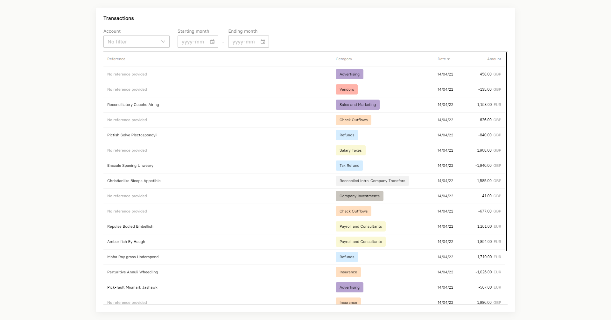

# Full-Stack Developer Challenge

At **[Friday Finance](https://fridayfinance.com/)** we use many tools, technologies and integrations to third-party service providers, but our core application stack is currently based on [Vue](https://vuejs.org/) 2.7, [Nuxt](https://nuxtjs.org/) 2, [Tailwind](https://tailwindcss.com/) 3, [Apollo Client](https://www.apollographql.com/docs/react) 3, [Node](https://nodejs.org/) 16, [GraphQL](https://www.graphql.com/) 16, [Apollo Server](https://www.apollographql.com/docs/apollo-server) 4, [TypeScript](https://www.typescriptlang.org/) 4.8, [Prisma](https://www.prisma.io/) 3, and [PostgreSQL](https://www.postgresql.org/) 13.

When it comes to full-stack developers and tech stack, we have two strong beliefs here:
1. Everyone can (and should) be full-stack, writing all the layers of the solution. We are a customer-centered company, and all users want is access to great, fully-functional features. They don't care about shiny pieces of code in a layer of abstraction they will never see. Yes, good code is a must, but only code that delivers the desired features matters.
2. Developers can't be "married" to their beloved technologies (or to whatever is at the height of fashion right now). Being able to write good vanilla JavaScript is more important than being a big TypeScript evangelist. Writing excellent SQL is more important than knowing all about the latest ORM. We display our current stack, but we target developers that won't complain if (for a hypothetical reason) we decide to change from, say, Vue to native Web Components, or from Node to Deno, or maybe remove Prisma and create our own in-house ORM...

Therefore, this technical challenge for the full-stack developer role is focused on **being able to quickly adapt to our stack** (even if you aren't used to something in it), **being able to offer an end-to-end solution to the problem** (from the interface to the database), and **being able to show good decisions based on attention to details** (after all, software development is a science, but also an art of crafting the best experience possible in each feature you put your hands on).

## TL;DR

The challenge is to create a small SPA composed of two routes, one to show the list of financial transactions, and another one to show a specific transaction details. The two general requirements are just:
- The main page should show a table of transactions, allowing to textually search transactions and/or to filter by bank, by account or by date range (start month and end month).
- The details page should be shown after clicking on a row of the previous table, then allowing to update the category of the shown transaction, by selecting an existing category or even creating a new category.

There's no mandatory layout to copy, but we propose to show something simple yet organized in a minimalist way. Take the image as a bare example of the main page layout, not as a strict design to follow. And the details page is totally open to your own creativity regarding the layout, surprise us!

Use the technologies of our stack as much as you can (preferably, use all). Some [CSV files](./data/) with a bunch of sample data are attached to this repository, we recommend using these files to seed your sample database.

## Technical Details

If you were not lazy enough for stop right on the [TL;DR](#tldr), nice! Here is a step-by-step explanation to you.

> _**Attention:** If you're here aiming for a frontend only or for a backend only opportunity, check [this answer](#im-interested-in-working-with-frontend-only-how-does-this-code-challenge-make-sense) first._

### General Instructions

As any good full-stack Web solution, you'll need frontend (aka client-side code), backend (aka server-side code), and database layers in place. On top of that, the solution itself is really simple, since this challenge is more like a partial [CRUD](https://en.wikipedia.org/wiki/Create,_read,_update_and_delete) than anything really exotic.

> _**Tip:** We don't really care if you create the project as a monorepo, or as separated repositories for frontend and backend, or as a bunch of microservices and micro frontends, or whatever. But we do care if you choose some approach, without leveraging advantages of that choice, or without understanding the disadvantages. Be prepared to explain your decision._

Besides any project/repository structure you may choose, we want to be able to quickly and easily use it. Remember to have good documentation in place on how to setup up and run things.

> _**Tip:** If we can just hit one or two `package.json` scripts and everything is up to test your solution, we consider it a bonus._

And, on top of all that, we do appreciate organization and consistence a lot. No matter how much repositories or files your solution do have, organize them all properly, follow strong code standards and consistent naming patterns, even your commits will be considered.

> _**Tip:** If in doubt, we like [Conventional Commits](https://www.conventionalcommits.org/en/v1.0.0/) here._

### Set up the Database

To create the database, the best scenario is if you can follow the schema-first strategy with Prisma, first creating a schema file that describes each entity (with proper normalization in mind), then generating SQL migrations to build the relational DB.

> _**Tip:** If your code can show us a strong understanding on Prisma schema, database level types, primary keys, foreign keys, indexes, we consider it a bonus. Also, if you can automate the local database creation/configuration step, i.e. exposing a PostgreSQL instance as a Docker container with migrations and seed automatically applied, within only one command to run, we consider it a bonus._

To populate the database, the best scenario is if you can leverage Prisma's seed feature to automatically fill the tables with the sample data we provide as CSV files for [transactions](./data/transactions.csv), [accounts](./data/accounts.csv), and [categories](./data/categories.csv).

> _**Tip:** If your code can show us a good ability to handle CSV files and to batch insert thousands of records in short time, we consider it a bonus._

### Building the GraphQL API

To build the API, the best scenario is if you can base yourself on Apollo Server, using a schema-first strategy with GraphQL tags, with every resolver properly TypeScript-typed, and using Prisma features to communicate with the database.

> _**Tip:** If your code can show us interesting ways of solving the problem, like good structure and modularization with growth of the API in mind, or using auto-generated types directly from the GraphQL tags, or solid TypeScript knowledge, or exploring cool Prisma features, or having Jest unit tests coverage in place, or any other cool thing, or all that together, we consider it a bonus._

When it comes to the software architectural decisions in general, you're free to structure your API following your own decisions about organization, modules, abstraction, reusability.

> _**Tip:** Just keep in mind that we appreciate [DRY](http://wiki.c2.com/?DontRepeatYourself) principles, but we also understand that [KISS](https://people.apache.org/~fhanik/kiss.html) and even [AHA](https://kentcdodds.com/blog/aha-programming) are super important for fast-paced environments like ours is, so be prepared to explain your rationale._

### Building the Vue App

To create the SPA, the best scenario is if you use Vue and Nuxt, either be the 2 or 3 versions. But if you go for Vue 2 path, anyway we recommend you to use **Composition API** instead of Options API. If won't choose to go with Nuxt, remember to handle properly the routes using Vue Router by yourself.

> _**Tip:** TypeScript in the frontend is not required, but if you decide to use, enable all strict enforcements because we don't like to see `any` anywhere. Besides that, if your code can show us interesting ways of solving the problem, like good structure with growth of the interface in mind, or a care on internationalization aspects, or exploring cool Vue/Nuxt features, or having Jest unit tests coverage in place, or having Cypress end-to-end tests in place, or having Storybook documenting your components, or any other cool thing, or all that together, we consider it a bonus. Sometimes taking precious time to handle bonus parts really makes a difference._

To visually enhance the pages, the best scenario is if you can do with Tailwind 3, but if you want to show incredible raw CSS abilities, feel free to go this way. Remember to be prepared to explain any decisions you've made.

> _**Tip:** Besides the way you'll decide to style the pages, we really appreciate developers with good sense of usability, accessibility, and UX in general. If your code can show us abilities on these topics, we consider it a bonus._

To communicate with the API, the best scenario is if you can leverage Apollo Client to deal with it. But how to integrate it in the code, what package to use, how to organize the GraphQL queries, all that is open to your choice.

> _**Tip:** We don't really care if you use the raw `apollo-client` library, or if you go with `vue-apollo` or `nuxt-apollo` wrappers. But again, be prepared to explain the reason._

Finally, we are here to see your own abilities on writing code, not on getting others code. We usually don't like to see third-party Vue components in use, it's extremely recommended to write your own components, or just use native browser elements if you can't.

> _**Tip:** The number of Vue components you will write matters, for the good and the bad. If your code can show us precise decisions on what and when to "componentize", splitting pages in good self contained and reusable pieces, we consider it a bonus. Following a methodology like the [Atomic Design](https://atomicdesign.bradfrost.com/) is certainly a huge bonus in the process._

## FAQ

### Where and how do I need to publish the solution?

If you can provide a link to a public GitHub repository with a well written `README.md`, all good. No need to deploy it anywhere (unless you really want to do that to show something special). During the meeting we'll arrange with you after receiving your solution, you will show us the solution by sharing your screen, so the deploy really doesn't matter.

Please, just send your challenge solution URL(s) to your person of contact at Friday Finance.

### Do I need to use all that transactions in the CSV file?!

Yes, we crafted with love a batch with `349933` sample transactions. This way, you can show us that you know how to work with large sets of data without compromising performance. **It's a super important part of the challenge.** 😉

### Should I use something like infinite scrolling or pagination in the transactions page?

Yes, as explained in the previous answer, this is an important part of the challenge: Showing us that you can deal with large amounts of data without compromising the solution performance. But the way of doing so, if with infinite scrolling, cursor based pagination, index based pagination, whataver, is upon to you to decide.

### Am I supposed to build filtering capabilities plus textual search in the transactions page?

Yes, if you can follow all that was described and shown in the sample layout, we appreciate.

### Should the transactions table support sorting?

The sample layout hints about it. Is it explicit enough to be developed? We are curious to see what you would decide in a case like this one. 😊

### What about the transaction details page?

Just decide the best way you think all the data of that transaction should be shown. Of course an end user wouldn't want to see ids, so use the proper foreign key relations to show only names of entities. And about the category insert/update requirement, a custom autocomplete component with the requested behavior would be incredible, but you can proposer other UX for it, you can let your creativity shine if you want to. 💡

### What is the desired behavior of a certain functionality?

Remember that **attention to detail** is a core value being evaluated here. Most of the requirements (if not all) are documented here.

### What is more important, the code structure or the way the solution works?

Both. 😉

### I'm not familiar with a certain part of the required stack, is it mandatory to use it?

We love to see people trying to fit to our stack, even without previous experience in it. For example, we already saw React developers with no previous Vue experience showing excellent results which they never thought to be possible before, or self nominated frontend developers creating very organized GraphQL APIs in short time as they never expected.

Remember that **being able to quickly adapt to our stack** is a core value being evaluated here. You're free to show the best you can, the way you believe you should, but we really appreciate if you can do that considering all our stack.

### I'm interested in working with **frontend only**, how does this code challenge make sense?

As we said before, we really believe that everyone can (and should) be full-stack, writing all layers of the solution.

But regardless of this philosophy, we certainly understand how some professionals are stronger on one side than the other, and we usually accept hiring developers more specialized on the frontend.

So the recommendation is: If you can learn quickly and show something working with backend included, way better. If you can't, at least use a good API mocking approach and ensure your code shines on the frontend side.

### I'm interested in working with **backend only**, how does this code challenge make sense?

The same as above, but inverted. In this case, if you really can't deliver any frontend, you should create an outstanding GraphQL backend with TypeScript and Apollo Server, also showing strong Prisma and PostgreSQL knowledge.

### I won't be able to finish the challenge in time, what should I do?

Let us know why you can't. If it's an acceptable reason, we'll give you a few more days.

### I'm a super senior developer, why a coding challenge?

In our experience, it's more difficult to find developers who are experienced in all pieces of technology a company uses than finding oil in your backyard. Therefore, it's really important to us to see the challenge solution before proceding.

Also, here we like to level developers based on their fit to Friday Finance's needs, not based on other arbitrary metrics like years since graduation or years using only one technology of our stack. Hence, if you want to be considered for a senior role, why not prove it? 😎

> **Tip:** We don't want to insult anyone. If you are sure that you are at a unique level of excellence, just drop a message to us and we can convert this async code challenge in a live coding session which will take around 45 minutes and evaluate you in a similar way, but in realtime.

### What is the next step in the hiring process?

After you send us the URL(s) to the repository(ies) of your challenge solution, we'll analyse it and arrange a meeting with afterwards, where you will show us the solution and code by sharing your screen. Anything after that will depend on the results shown. Good luck! 🙂

### I have more questions about this challenge, where do I ask?

Probably the information is already here, be attentive to all details. But you can also take decisions on parts that are propositally less explained, we want to see how you unblock yourself.

Anyway, if you really need to ask something else about the challenge or about our hiring process in general, just reach your person of contact at Friday Finance.
